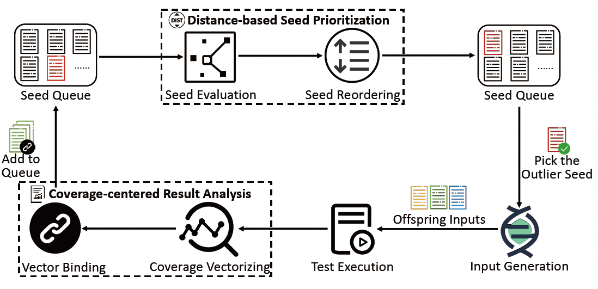
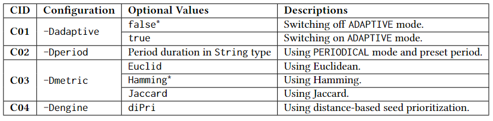

## Zest-DiPri: Zest with Distance-based Seed Prioritization.

This is the Java implementation of our paper: *DiPri: Distance-based Seed Prioritization for Greybox Fuzzing*. You can read our [FUZZING'23 paper](https://dl.acm.org/doi/10.1145/3605157.3605172) or TOSEM paper (under reviewed  at the time this document is updated) to learn more about the basic hypothesis and approach designs of DiPri. This prototype is essentially an extension of the famous Java fuzz testing platform JQF with Zest as the fuzzing algorithm. To learn more about JQF+Zest, please refer to their [GitHub repo]([rohanpadhye/JQF: JQF + Zest: Coverage-guided semantic fuzzing for Java. (github.com)](https://github.com/rohanpadhye/JQF)).

### Approach and Configurations



The above picture shows the high-level workflow of DiPri. Specifically, DiPri splits seed prioritization into two stages, i.e., seed evaluation and seed reordering. Zest-DiPri adopts a distance-based strategy to evaluate and assign priority scores for seeds. The distance-based strategy could by controlled through different prioritization modes and distance measures. The following picture display the configurations supported by Zest-DiPri, which are essentially a group of maven plugin command parameters. Note that the default configurations is tagged with *.



**Prioritization modes.** DiPri provides three prioritization modes, namely `VANILLA`, `PERIODICAL`, and `ADAPTIVE`. Zest-DiPri will conduct prioritization at different timings under different modes. The features of the modes are as follows:

- `VANILLA` mode: prioritizes every time the seed queue is updated.
- `PERIODICAL` mode: prioritizes periodically with a preset duration.
- `ADAPTIVE` mode: prioritizes when all last prioritized seeds are picked for input generation.

### Install and Run Zest-DiPri

you can use the following instructions to install and run Zest-DiPri:

```shell
git clone https://github.com/isefuzz/zest-dipri.git
mvn clean install
mvn jqf:fuzz -Dclass=<fully-qualified-class-name> -Dmethod=<method-name> [dipri-configuration...]
```

### Run with Docker

prerequisites

```
mvn clean install
chmod +x ./dipri.sh
chmod +x ./zest.sh
```

Run a set of experiments: 10 rounds, 24 hours per round

```
./dipri.sh <name> <fully-qualified-class-name> <method-name> <path-to-the-result> <mode> 0 9
```

Run an experiment

```
mvn jqf:fuzz -Dclass=<fully-qualified-class-name> -Dmethod=<method-name> [dipri-configuration...]
```

